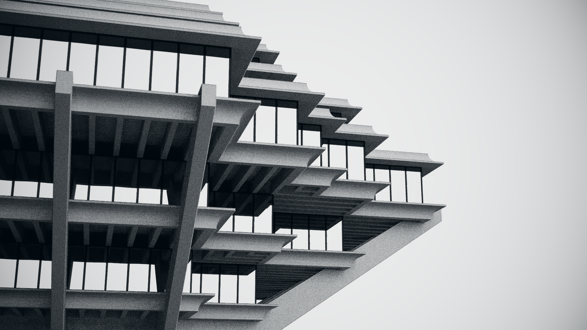

# "Brutal Knowledge" by yx

This is a procedural artwork released at Demosplash 2019, placing 1st in the Freestyle Graphics competition.

This source code release is for archival reasons - as such, aside from removal of compiled and intermediate binaries, this is an unedited snapshot of the source from when the released artwork was built.

This uses [Shader_Minifier](https://github.com/laurentlb/Shader_Minifier) for shader minification and [Crinkler](https://github.com/runestubbe/Crinkler) for executable compression. Binaries are included in the archive as the exact versions that were used for the release.

Download & comments: https://www.pouet.net/prod.php?which=83690

Some post-mortem thoughts:

* The building model is based on the UCSD Geisel Library. Several photos and architectural diagrams were consulted during production.

* There is one notable inaccuracy in the model - the slats on the underside of the building should be rotated by 90°.

* The sky is a cheat - the sky visible in the image is completely different from the sky that's actually illuminating the building.
